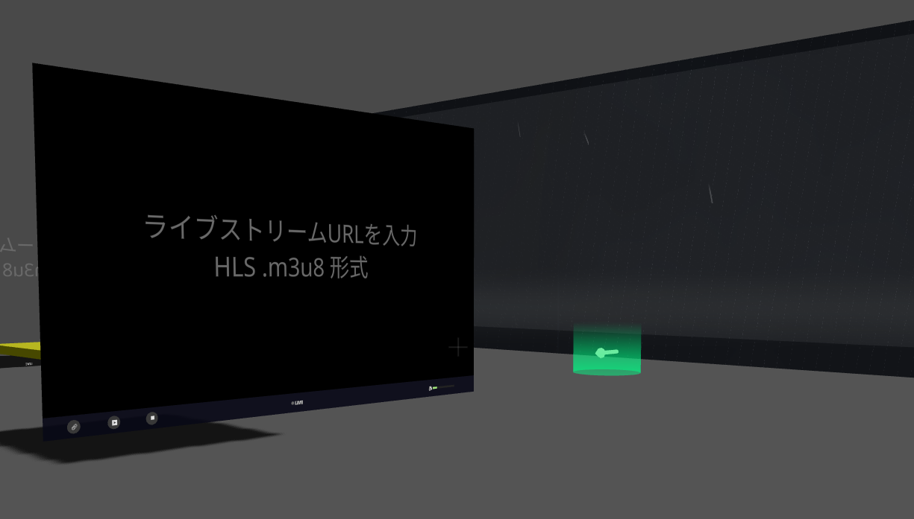

# XRift World - Rainy World




## 概要

XRiftプラットフォーム向けの、雨の日の室内ワールドです。雨天の空（シェーダー）と大きな窓、環境音BGM、入退室ログなどを配置しています。

## 特徴

- 雨天の空（`RainSky`）
- 正面の大きな窓（`RainWindow`）
- 雨の環境音BGM（`RainBGM`）
  - ブラウザの自動再生制限により、起動直後の再生が拒否される場合があります
  - その場合は最初のクリック/タップ/キー入力などのユーザー操作後に再生を再試行します
- 入口付近の入退室ログボード（`EntryLogBoard`）
  - 参加者の入室時にチャイム音（`public/chime.mp3`）を再生します（環境により自動再生制限の影響を受けます）
- タグボード（`TagBoard`）
- 画面共有ディスプレイ（`ScreenShareDisplay`）と LiveVideo（`LiveVideoPlayer`）の配置

## 技術スタック

- React 19 / TypeScript 5.6 / Vite 7
- @react-three/fiber（R3F）/ @react-three/drei
- @react-three/rapier（物理演算）
- Three.js
- @xrift/world-components

※ 正確な依存バージョンは [package.json](package.json) を参照してください。

## セットアップ

```bash
npm install
npm run dev
```

- 開発サーバー: http://localhost:5173
- 型チェック: `npm run typecheck`
- プレビュー: `npm run preview`
- XRiftへのアップロード: `xrift upload world`

## ワールド構成

- メインシーン: [src/World.tsx](src/World.tsx)
- コンポーネント
  - 雨BGM: [src/components/RainBGM/index.tsx](src/components/RainBGM/index.tsx)
  - 雨空（シェーダー）: [src/components/RainSky/index.tsx](src/components/RainSky/index.tsx)
  - 窓: [src/components/RainWindow/index.tsx](src/components/RainWindow/index.tsx)
  - 入退室ログボード: [src/components/EntryLogBoard/index.tsx](src/components/EntryLogBoard/index.tsx)

## アセット

- サムネイル: `public/thumbnail.png`
- 雨BGM: `public/Rain-Real_Ambi01-1.mp3`
- チャイム: `public/chime.mp3`

## ディレクトリ構成

```
rainy-world/
├── public/
│   ├── Rain-Real_Ambi01-1.mp3
│   ├── chime.mp3
│   └── thumbnail.png
├── src/
│   ├── components/
│   │   ├── EntryLogBoard/
│   │   ├── RainBGM/
│   │   ├── RainSky/
│   │   └── RainWindow/
│   ├── constants.ts
│   ├── dev.tsx
│   ├── index.tsx
│   └── World.tsx
├── package.json
├── tsconfig.json
├── vite.config.ts
└── xrift.json
```

## 開発メモ

- ローカル開発では [src/dev.tsx](src/dev.tsx) で `XRiftProvider` を `baseUrl` `/` でラップしています。
- アセット読み込みは `useXRift()` から得る `baseUrl` を接頭辞として使用してください（`RainBGM` / `EntryLogBoard` の音声URL生成でも利用しています）。
- 音声再生はブラウザ側の自動再生制限の影響を受けることがあります。

## クレジット

- 効果音は OtoLogic の素材を使用しています（ワールド内表記も参照）

## ライセンス

MIT
