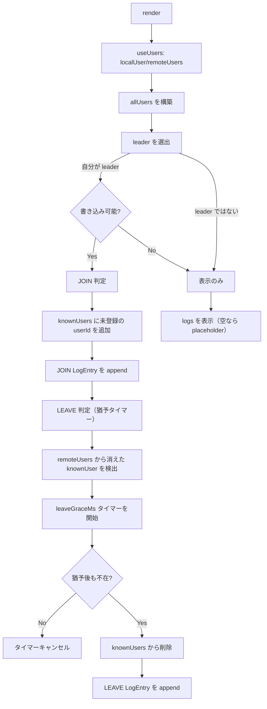
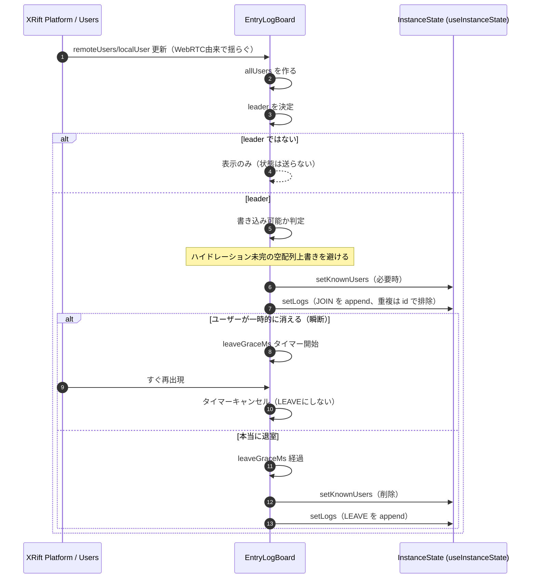

# EntryLogBoard（入退室ボード）

XRift は WebRTC ベースのため、遅延や瞬断で `remoteUsers` が一時的に欠けることがあります。
このコンポーネントは、そういった揺らぎに耐えながら「入室/退室ログ」をインスタンス全体で共有表示します。

## 目的

- `useUsers()`（local/remote）から参加者の集合を取得
- **代表者（leader）1人だけ**が状態を更新して、全員へ共有
- 瞬断対策として退室判定に猶予（デバウンス）を入れる
- `useInstanceState()` の初期未同期で **既存状態を上書きしない**

## 状態（useInstanceState）

- `logsStateKey = ${stateNamespace}-logs`
  - `LogEntry[]`
  - 画面に表示する入退室ログ
- `knownUsersStateKey = ${stateNamespace}-known-users`
  - `KnownUser[]`
  - 「現在在室中」として扱うユーザー集合

> 注意: `useInstanceState()` はローカル state を即時更新しつつ、`sendState()` で共有側へ送信します。
> そのため、まだ共有側がハイドレーションされていない状態で `setLogs([])` などを送ると、**既存ログが消える**事故が起こり得ます。

## リーダー（leader）

- `leaderUserId = getLeaderUserId(allUsers)`
- 最小の `id`（文字列ソート）をリーダーとして扱います
- **リーダーだけ**が `setKnownUsers / setLogs` を実行します

## パラメータ

- `leaveGraceMs`（デフォルト `5000`）
  - 退室確定までの猶予。瞬断で OUT→IN が連続するのを抑制します。
- `leaderHydrationGraceMs`（デフォルト `3000`）
  - 「自分しかいない」ケースに限り、初回の入室ログ生成を遅延させる猶予。
  - 既に他ユーザーがいるのに未ハイドレーションで書き込むのは危険なので、タイマー解禁は制限しています。

---

## フローチャート（全体）

---

## シーケンス図（JOIN/LEAVE と瞬断耐性）

---

## ログID（重複排除のキー）

- JOIN: `join-${userId}-${joinedAt}`
- LEAVE: `leave-${userId}-${joinedAt}`

`appendLogs()` では `entry.id` を key として重複排除してから、`maxEntries` 件に切り詰めます。

## 既知の注意点

- リーダーの決め方が `id` のソートなので、参加者の出入りで leader が変わります。
- leader 交代直後は、共有 state が手元に届くまで（=ハイドレーションまで）更新を抑止します。
  - これにより「既存ログの消失」を防げますが、環境によっては反映が遅く見えることがあります。

